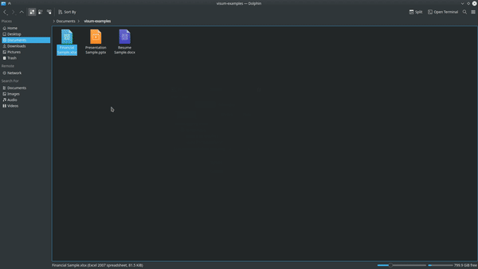

# Visum

In-browser Office files viewer for Linux.

<br/>


[](https://github.com/VladimirMikulic/tessy)
[](#)
[](https://twitter.com/VladoDev)

## 🔥 Why Visum?

**Visum was created to solve the problem of viewing office files on Linux the right way.**

The problem with Microsoft Office alternatives for Linux is that they are unusable for various reasons. Libre Office has a dreaded design from the 90s, WPS needs font patching, installations result in unresolved dependencies, partial Windows Office files compatibility, and the list goes on...

It's frustrating to install +500Mb office, patch its numerous errors only to find out that it even can't correctly display your document. You switch to another distro, and you go through this again.

Visum is different because it uses Microsoft Office Online version to display your files, so you can be sure that your files are displayed correctly. No more missing text, inverted colours, distorted shapes etc. Visum is very lightweight as well, only 2 scripts and you are good to go! Suitable for everyone, from hobbyist distro hoppers & developers, all the way to students and non-techies.

#### Benefits of using Visum:

- 🚀 Blazingly fast

- 🔌 Customizable

- ⚡ Built on pre-installed technologies

- 💻 Lightweight to install

- 🚫 NO need for an online account

## :package: Installation

Install Visum by running these commands:

```sh
# Clone the repo
git clone https://github.com/VladimirMikulic/visum.git
# Make installer executable
chmod +x visum/install.sh
# Run the installer
./visum/install.sh
```

### Freedom to choose!

Visum gives you freedom to select the Office of your choice!

- Google's Office
- Microsoft's Office

By default, your Office files will be opened in Microsoft Office in your default browser.

You can switch Office Suites by opening and modifying Visum config file `~/.config/visum/visum.conf`.

To use Google's Office modify `VISUM_PREFERRED_OFFICE` like this:

```sh
VISUM_PREFERRED_OFFICE=GOOGLE_OFFICE
```

To switch back to Microsoft's Office:

```sh
VISUM_PREFERRED_OFFICE=MICROSOFT_OFFICE
```

That's it! Now you can view Office files in your browser! 🎉

## :cloud: Usage

Watch Visum in action! The full demo video can be found [here](https://youtu.be/tKexhL8MoGI).



## :sparkles: Run tests

Visum uses Python 3 core lib `unittest` for testing.

Tests can be executed by running:

```sh
python3 test/test_visum.py
python3 test/test_server.py
```

## :man: Author

**Vladimir Mikulic**

- Twitter: [@VladoDev](https://twitter.com/VladoDev)
- Github: [@VladimirMikulic](https://github.com/VladimirMikulic)
- LinkedIn: [@vladimirmikulic](https://www.linkedin.com/in/vladimir-mikulic)

## :handshake: Contributing

Contributions, issues and feature requests are welcome!

## 🍻 Credits

Logo design inspired by [Freepik](http://www.freepik.com). ❤️

## :pencil: License

This project is licensed under [MIT](https://opensource.org/licenses/MIT) license.

## :man_astronaut: Show your support

Give a ⭐️ if this project helped you!
